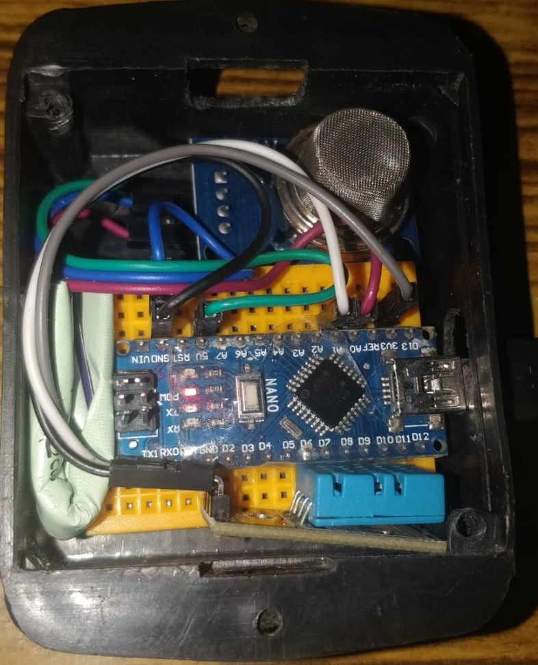

# arduino-usb-serial-interface
USB Serial interface between arduino to android and python

*Device Support: Only tested on android 5, 6, 7 and 8.*

### Hardware Device  
   
*Note: No external power supply is needed for arduino. Phone will power the arduino via usb.<br>
Phone should have OTG support.*


### HAQT app <a href="https://drive.google.com/open?id=1QkfwZ5lyCaG8pm2cIbEduOcPqybLoP3Q" target="_blank">(link)</a><br>


### Python
cd into the repo folder   
`python3 arduthon.py`  


## How to read serial data 
### Android:
<br>To read serial data which is in bytes  
```byte[] response = new bytes[3];```   
```port.read(response, READ_WAIT_MILLIS);```

### Python:  
Windows:  
library: pyserial<br>
```arduino = serial.Serial('COM4', 9600, timeout=0)```<br>
```data = arduino.readline() ```

Ubuntu:  
`sudo apt-get install python-serial`  
Change this line to  
`arduino = serial.Serial('/dev/ttyACM0', 9600, timeout=0)`  

## Refer
https://github.com/mik3y/usb-serial-for-android
